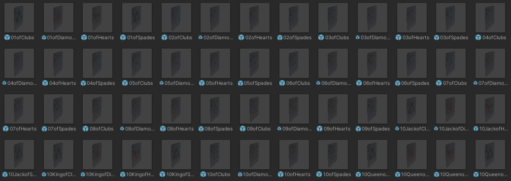
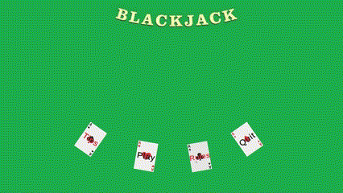

 [**LoadLevels**](#LoadLevels)
 [**DeackScript**](#DeackScript)
 [**PlayerScript**](#PlayerScript)
 [**ThrowMechanicScript**](#ThrowMechanicScript)
 [**IABrainScript**](#IABrainScript)
# The Game
Blackjack, also known as twenty-one, is a comparing card game between usually several players
and a dealer, where each player, in turn, competes against the dealer, but players do not play
against each other. The objective of the game is to beat the dealer in one of the following ways:

● Get 21 points on the player's first two cards (called a "blackjack" or "natural"), without a
dealer blackjack;

● Reach a final score higher than the dealer without exceeding 21;

● Let the dealer draw additional cards until their hand exceeds 21.

## Compared to the full game, some differences in rules/simplifications:
● Players do not see any of your cards. The "AI" behind the players is super simple, above 15 points the AI player has x % of wanting another card".

● No betting part and its rules. it just determine who wins
and who loses at each round.

● Players can just ask "one more card", "bust" or "stop". no "insurance" or
particular behaviours based on your current cards.

● The game is divided into "player turn" and "dealer turn". During the player turn, ALL the
players will ask, at the same time, cards (or stop/bust). When all the players are done with
their requests, it will be the dealer’s turn (yours).

## Features
● You, the dealer, will be in charge to "pick" the cards and give them to the players. You can throw the card and let it fly
towards the player as fast as you can. This means that you can have two cards travelling
towards a player, but he's actually asking only one. This means you will be able to throw
cards "in the void" (because you miss the players).
### ________________ Throw Mechanic ________________

## 
● The card deck is "realistic". So, it’s made of exactly 52 cards (of the french-suited set), with
their values. If a certain card is on the table, it won't be in the deck.


## 
● The deck is perfectly ordered, by default. You have a button close to the deck that shuffles
it.
### ___________________ Shuffled _______________________________________ Not Shuffled ___________________
 
## 
● There are Screen Space UI (eg. the menu button) and World Space UI (eg. shuffle buttons). You should give all
the information needed and the feedback elements needed to understand the game.
### ______________________ Menu ______________________

## 
● The AI characters humanoid react to their specific game
state updates (waiting for a new card, busted...) through animations.
### ____________________ Gameplay ____________________

## 
● At the end of each round, the cards on the table get put together and put at the bottom of
the deck.
``` cpp
public void PutUnderDeck(String Card)
{
    //check if we click on the same card twice in a row
    if (previousName == Card)
    {
        return;
    }
    //if the throw a card we cant no longer shuffle the deck
    UnableDeck = true;

    //we search the card in the Deck and find the index to swap after
    for (int i = 0; i < Deck.Length; i++)
    {
        if (Deck[i].name == Card)
        {
            Index = i;
        }
    }

    //create a new Array with 52 slots
    GameObject[] PutUnderDeck = new GameObject[52];

    //we copy the Deck in the new Deck
    Deck.CopyTo(PutUnderDeck, 0);

    //we move by one every card in the deck
    for (int i = PutUnderDeck.Length - 2; i >= 0; i--)
    {
        PutUnderDeck[i + 1] = PutUnderDeck[i];
    }
    //move the Clicked card on the bottom
    PutUnderDeck[0] = Deck[Index];

    //we copy the shuffled deck in the Deck
    PutUnderDeck.CopyTo(Deck, 0);
    previousName = Card;
}
```
##
Graphical assets downloaded from the internet.

Free Rigged/animated humanoid models founded on https://www.mixamo.com.

The project is developed using Unity and C# language!

All the code produced from my own, without any use of plugins.
##

# PlayerScript
``` cs
using System;
using System.Collections;
using System.Collections.Generic;
using TMPro;
using UnityEngine;
using static UnityEngine.UIElements.UxmlAttributeDescription;

public class PlayerScript : MonoBehaviour
{
    //variable used to assign multiple card values
    private int Card;

    //used to Know where to put cards
    [SerializeField]public GameObject CardPosition;

    //copy of where to put cards
    private GameObject CardPositionCopy;

    //Reference to Pòayers
    [SerializeField]private GameObject Player1;
    [SerializeField]private GameObject Player2;
    [SerializeField]private GameObject Player3;

    //number of one in the dealerZone
    private int NumberOfOnes;

    //sum of all the dealer cards
    private int Total;

    //Variable to know when we can reset the deck
    private bool ResetDeck = false;

    //Text_TMP to know whose turn it is
    [SerializeField]private TMP_Text Turn;

    //Gameobject used to move card in cardposition
    private GameObject cardToMove;

    //bool to know if Dealer has to move cards
    private bool isMovingCard = false;

    //bool to know if all player have finisched their turn
    [NonSerialized] public bool AllEnemyReady = false;

    [SerializeField]private DeckScript deckScript;

    // Start is called before the first frame update
    void Start()
    {
        ClearVaribles();
    }

    // Update is called once per frame
    void Update()
    {
        //Check if every IA has WaitingForPlayer true
        if (Player1.gameObject.GetComponent<IABrainScript>().WaitingForPlayer == true && Player2.gameObject.GetComponent<IABrainScript>().WaitingForPlayer == true && Player3.gameObject.GetComponent<IABrainScript>().WaitingForPlayer == true)
        {
            if (!AllEnemyReady)
            {
                ChangeTurn();
            }
            AllEnemyReady = true;
        }

        //Check if a card is assigned and if the bollean value is true
        if (isMovingCard && cardToMove != null)
        {
            //Interpolate the current Card with the Position were it as to be
            cardToMove.transform.position = Vector3.Lerp(cardToMove.transform.position, CardPositionCopy.transform.position, 0.3f);

            //Check if it is almost close to the position
            if (Vector3.Distance(cardToMove.transform.position, CardPositionCopy.transform.position) < 0.5f)
            {
                //we reset the velocity of the card to stop them and start moving it to the correct position
                cardToMove.GetComponent<Rigidbody>().velocity = Vector3.zero;
                //we move the card in the correct position
                cardToMove.transform.position = CardPositionCopy.transform.position;
                //because the player can receve more than 3 cards implemented only one position that is updated every time the dealer receve another card
                CardPositionCopy.transform.position += new Vector3(0.2f, 0.05f, 0);
                //Remove the card assignment
                cardToMove = null;
                isMovingCard = false;
            }
        }
    }

    //Just an example of operator ternary to change the Text on the table
    void ChangeTurn()
    {
        //if Turn.text = "Turn: Players" then Turn: Dealer otherwise Turn: Players
        Turn.text = (Turn.text == "Turn: Players") ? "Turn: Dealer" : "Turn: Players";
    }

    private void OnTriggerEnter(Collider other)
    {
        //this if active the OnTriggerEnter only if all the Ia have finished their turn
        if (AllEnemyReady)
        {
            //we try to convert to int the firsts 2 letter of the name of the card to assign the value
            int.TryParse(other.gameObject.name.Substring(0, 2), out Card);

            StartMovingCard(other.gameObject);

            //because the player can receive up to 4 ace, i implemented a value that track how many 1 the player have so that if the total is greater than 21 an the player has one o more one to convert back in to one the total doesnt exceed 21
            if (Card == 1)
            {
                if (Total + Card <= 21)
                {
                    Card = 11;
                    NumberOfOnes = NumberOfOnes + 1;
                }
            }
            if (Card + Total > 21)
            {
                if (NumberOfOnes > 0)
                {
                    Total = Total - 10;
                    NumberOfOnes--;
                }
            }
            Total = Total + Card;
        }
    }

    //call the action in alls the IAs and pass the Dealer total to know who wins and who lost
    public void SendTotal()
    {
        //only if all the player are ready the button "Stay" can be pressed
        if (AllEnemyReady)
        {
            IABrainScript[] allBrains = FindObjectsOfType<IABrainScript>();

            //for each IA call the Action Win or Lose
            foreach (IABrainScript brain in allBrains)
            {
                brain.WinOrLose.Invoke(Total);
                ResetDeck = true;
            }
            if (ResetDeck)
            {
                //variable used to block the "shuffle" button
                deckScript.UnableDeck = false;

                //create a new deck with the new order of card
                deckScript.SpawnDeck();

                //set AllEnemtReady to falls so the button Stay cant be pressed again
                AllEnemyReady = false;

                ClearVaribles();

            }

        }
    }

    //method to start the lerp in the update
    private void StartMovingCard(GameObject Card)
    {
        cardToMove = Card;
        isMovingCard = true;
    }

    //clear all the variables
    private void ClearVaribles()
    {
        CardPositionCopy = CardPosition;
        ChangeTurn();
        Card = 0;
        NumberOfOnes = 0;
        Total = 0;
        ResetDeck = false;
        isMovingCard = false;
        AllEnemyReady = false;
    }
}
```

# ThrowMechanicScript
``` cs
using System;
using System.Collections.Generic;
using Unity.VisualScripting;
using UnityEngine;
using UnityEngine.UIElements;
using static UnityEngine.UIElements.UxmlAttributeDescription;

public class ThrowMechanicScript : MonoBehaviour
{
    //strength of the throws 
    [SerializeField, Range(1, 10)]private float throwForce;

    //String used to search the card in the array of Card
    [NonSerialized]public new string name;

    //Gameobject to know have to be moved
    private GameObject objectToDrag;

    //LineRender used to visually see where the player is throwing the card
    [SerializeField] private LineRenderer lineRenderer;

    //starting position for the Line Rendere
    private Vector3 startMousePosition;

    //starting position of the card
    private Vector3 startObjectPosition;

    //bool to know if something is dragged
    private bool isDragging = false;

    //Rigidbody to apply  the throw force
    private Rigidbody rigidbody;

    //Used to know information about what hit the raycast
    private RaycastHit hit;

    [SerializeField] private DeckScript deckScript;
    void Start()
    {

    }

    void Update()
    {
        //Manage the mouse click
        if (Input.GetMouseButtonDown(0))
        {
            StartDrag();
        }
        else if (Input.GetMouseButtonUp(0))
        {
            EndDrag();
        }

        if (isDragging)
        {
            UpdateLine();
        }
    }

    //If the player click with the mouse this method is called
    //This method allow to drag card in the level
    void StartDrag()
    {
        //Cast a ray from the camera to the mousePosition
        Ray ray = Camera.main.ScreenPointToRay(Input.mousePosition);

        //If the ray hit something, it check if it is a card, otherwise it does nothing
        if (Physics.Raycast(ray, out hit, Mathf.Infinity))
        {
            //Assign the hit gameobject
            objectToDrag = hit.transform.gameObject;

            //Check if it as the "Card" tag
            if (objectToDrag.tag == "Card")
            {
                //Assign the position to use it for draw the Line Render and to calculate the throw direction
                startObjectPosition = objectToDrag.transform.position;

                //Assign the rigidbody for applying the force later
                rigidbody = objectToDrag.GetComponent<Rigidbody>();

                //Assign the name of the object and remove the last 7 char "(Clone)", used to check if the card throw is put below the deck
                name = hit.transform.gameObject.name;
                deckScript.PutUnderDeck(name.Substring(0, name.Length - 7));

                isDragging = true;
                lineRenderer.enabled = true;
            }
            else //If it does not have the "Card" tag, we have to unassign
            {
                objectToDrag = null;
            }
        }
    }

    //Method used to Update the Line Rendrer to draw the throw direction
    void UpdateLine()
    {
        //If the object to throw is null exit from this method
        if (objectToDrag == null)
        {
            return;
        }

        //We save the mouseposition
        Vector3 mousePosition = Input.mousePosition;

        //We convert the object Drag position to Screen Points to respect the camera deep
        mousePosition.z = Camera.main.WorldToScreenPoint(objectToDrag.transform.position).z;

        //Then we convert everything in WorldPoint to draw the ray
        Vector3 worldMousePosition = Camera.main.ScreenToWorldPoint(mousePosition);

        //Draw StartPosition
        lineRenderer.SetPosition(0, startObjectPosition);
        //Draw EndPosition
        lineRenderer.SetPosition(1, worldMousePosition);
    }

    void EndDrag()
    {
        //If the object to throw is null exit from this method
        if (objectToDrag == null)
        {
            return;
        }

        isDragging = false;
        lineRenderer.enabled = false;

        //We save the mouseposition
        Vector3 mousePosition = Input.mousePosition;

        //We convert the object Drag position to Screen Points to respect the camera deep
        mousePosition.z = Camera.main.WorldToScreenPoint(objectToDrag.transform.position).z;

        //Then we convert everything in WorldPoint to draw the ray
        Vector3 worldMousePosition = Camera.main.ScreenToWorldPoint(mousePosition);

        //We calculate and Normalize to obtein the vector Direction
        Vector3 direction = (worldMousePosition - startObjectPosition).normalized;

        //we calculate the distance, more distance = more force
        float distance = Vector3.Distance(startObjectPosition, worldMousePosition);

        //We add the force to the RigidBody to throw the object
        rigidbody.AddForce(direction * throwForce * distance, ForceMode.Impulse);

        objectToDrag = null;
        rigidbody = null;
    }
}
```

# IABrainScript
``` cs
using System;
using System.Collections;
using System.Collections.Generic;
using Unity.VisualScripting;
using Unity.VisualScripting.Antlr3.Runtime.Tree;
using UnityEngine;
using UnityEngine.UIElements;

public class DeckScript : MonoBehaviour
{
    //array containing all the card in order
    [SerializeField]private GameObject[] Deck;

    //index of the Card
    private int Index;

    //position of the spawned card
    private float x, y, z;
    private float SpawnPoint;

    //Distance to apply from each card spawned
    [SerializeField]private float distance;

    //bool used to deactivate the shuffle button
    [NonSerialized]public bool UnableDeck = false;

    //copy of the previous card name put under the deck
    private String previousName;

    void Start()
    {
        //assign x y z
        x = gameObject.transform.position.x;
        y = gameObject.transform.position.y;
        z = gameObject.transform.position.z;

        SpawnDeck(Deck);
    }

    //SpawnDeck callable from outside the script
    public void SpawnDeck()
    {
        SpawnDeck(Deck);
    }

    private void SpawnDeck(GameObject[] DeckToSpawn)
    {
        //Find all the gameobject with teh tag "Card"
        GameObject[] DeleteDeck = GameObject.FindGameObjectsWithTag("Card");

        //Destroy the previous deck
        foreach (GameObject Card in DeleteDeck)
        {
            Destroy(Card);
        }

        SpawnPoint = y;
        foreach (GameObject Card in DeckToSpawn)
        {
            //increase the Spawn Point do the card spawned doesn't collide with other cards
            SpawnPoint += distance;
            
            //create a new Card
            GameObject newCard = Instantiate(Card);

            //Spawn the card with correct position and rotation, transform unity use quaternion so we convert a Vector3 in to a Quaternion
            newCard.transform.rotation = Quaternion.Euler(new Vector3(-90, 0, 0));
            newCard.transform.position = new Vector3(x, SpawnPoint, z);
        }
        UnableDeck = false;
    }


    //Generate a deck with all the Card Shuffled
    public void ShuffleDeck()
    {
        //if the bool id false the deck cant be shuffled because a round is started
        if (!UnableDeck)
        {
            //create a new Array with 52 slots
            GameObject[] shuffledDeck = new GameObject[52];

            //we copy the Deck in the new Deck
            Deck.CopyTo(shuffledDeck, 0);

            //we iterate the Array, to each card we assign a random position and we swap the cards, then we swap another card 
            for (int i = 0; i < shuffledDeck.Length; i++)
            {
                int randomIndex = UnityEngine.Random.Range(0, shuffledDeck.Length);
                GameObject temp = shuffledDeck[i];
                shuffledDeck[i] = shuffledDeck[randomIndex];
                shuffledDeck[randomIndex] = temp;
            }

            //we copy the shuffled deck in the Deck
            shuffledDeck.CopyTo(Deck, 0);
            SpawnDeck(Deck);
        }
    }

    //method used to put the card that we throw under the deck
    public void PutUnderDeck(String Card)
    {
        //check if we click on the same card twice in a row
        if (previousName == Card)
        {
            return;
        }
        //if the throw a card we cant no longer shuffle the deck
        UnableDeck = true;

        //we search the card in the Deck and find the index to swap after
        for (int i = 0; i < Deck.Length; i++)
        {
            if (Deck[i].name == Card)
            {
                Index = i;
            }
        }

        //create a new Array with 52 slots
        GameObject[] PutUnderDeck = new GameObject[52];

        //we copy the Deck in the new Deck
        Deck.CopyTo(PutUnderDeck, 0);

        //we move by one every card in the deck
        for (int i = PutUnderDeck.Length - 2; i >= 0; i--)
        {
            PutUnderDeck[i + 1] = PutUnderDeck[i];
        }
        //move the Clicked card on the bottom
        PutUnderDeck[0] = Deck[Index];

        //we copy the shuffled deck in the Deck
        PutUnderDeck.CopyTo(Deck, 0);
        previousName = Card;

    }
}

```
# DeackScript
``` cs
using System;
using System.Collections;
using System.Collections.Generic;
using Unity.VisualScripting;
using Unity.VisualScripting.Antlr3.Runtime.Tree;
using UnityEngine;
using UnityEngine.UIElements;

public class DeckScript : MonoBehaviour
{
    //array containing all the card in order
    [SerializeField]private GameObject[] Deck;

    //index of the Card
    private int Index;

    //position of the spawned card
    private float x, y, z;
    private float SpawnPoint;

    //Distance to apply from each card spawned
    [SerializeField]private float distance;

    //bool used to deactivate the shuffle button
    [NonSerialized]public bool UnableDeck = false;

    //copy of the previous card name put under the deck
    private String previousName;

    void Start()
    {
        //assign x y z
        x = gameObject.transform.position.x;
        y = gameObject.transform.position.y;
        z = gameObject.transform.position.z;

        SpawnDeck(Deck);
    }

    //SpawnDeck callable from outside the script
    public void SpawnDeck()
    {
        SpawnDeck(Deck);
    }

    private void SpawnDeck(GameObject[] DeckToSpawn)
    {
        //Find all the gameobject with teh tag "Card"
        GameObject[] DeleteDeck = GameObject.FindGameObjectsWithTag("Card");

        //Destroy the previous deck
        foreach (GameObject Card in DeleteDeck)
        {
            Destroy(Card);
        }

        SpawnPoint = y;
        foreach (GameObject Card in DeckToSpawn)
        {
            //increase the Spawn Point do the card spawned doesn't collide with other cards
            SpawnPoint += distance;
            
            //create a new Card
            GameObject newCard = Instantiate(Card);

            //Spawn the card with correct position and rotation, transform unity use quaternion so we convert a Vector3 in to a Quaternion
            newCard.transform.rotation = Quaternion.Euler(new Vector3(-90, 0, 0));
            newCard.transform.position = new Vector3(x, SpawnPoint, z);
        }
        UnableDeck = false;
    }


    //Generate a deck with all the Card Shuffled
    public void ShuffleDeck()
    {
        //if the bool id false the deck cant be shuffled because a round is started
        if (!UnableDeck)
        {
            //create a new Array with 52 slots
            GameObject[] shuffledDeck = new GameObject[52];

            //we copy the Deck in the new Deck
            Deck.CopyTo(shuffledDeck, 0);

            //we iterate the Array, to each card we assign a random position and we swap the cards, then we swap another card 
            for (int i = 0; i < shuffledDeck.Length; i++)
            {
                int randomIndex = UnityEngine.Random.Range(0, shuffledDeck.Length);
                GameObject temp = shuffledDeck[i];
                shuffledDeck[i] = shuffledDeck[randomIndex];
                shuffledDeck[randomIndex] = temp;
            }

            //we copy the shuffled deck in the Deck
            shuffledDeck.CopyTo(Deck, 0);
            SpawnDeck(Deck);
        }
    }

    //method used to put the card that we throw under the deck
    public void PutUnderDeck(String Card)
    {
        //check if we click on the same card twice in a row
        if (previousName == Card)
        {
            return;
        }
        //if the throw a card we cant no longer shuffle the deck
        UnableDeck = true;

        //we search the card in the Deck and find the index to swap after
        for (int i = 0; i < Deck.Length; i++)
        {
            if (Deck[i].name == Card)
            {
                Index = i;
            }
        }

        //create a new Array with 52 slots
        GameObject[] PutUnderDeck = new GameObject[52];

        //we copy the Deck in the new Deck
        Deck.CopyTo(PutUnderDeck, 0);

        //we move by one every card in the deck
        for (int i = PutUnderDeck.Length - 2; i >= 0; i--)
        {
            PutUnderDeck[i + 1] = PutUnderDeck[i];
        }
        //move the Clicked card on the bottom
        PutUnderDeck[0] = Deck[Index];

        //we copy the shuffled deck in the Deck
        PutUnderDeck.CopyTo(Deck, 0);
        previousName = Card;

    }
}

```

# LoadLevels
``` cs
using System.Collections;
using System.Collections.Generic;
using UnityEngine;
using UnityEngine.SceneManagement;

//script used to load levels (Used on GUI) 
public class LoadLevels : MonoBehaviour
{
    //Load the Game Level
    public void LoadGame()
    {
        SceneManager.LoadScene("Game");
    }

    //Load the menu level
    public void LoadMenu()
    {
        SceneManager.LoadScene("Menu");
    }

    //close the Game
    public void Quit()
    {
        Application.Quit();
    }
}
```
